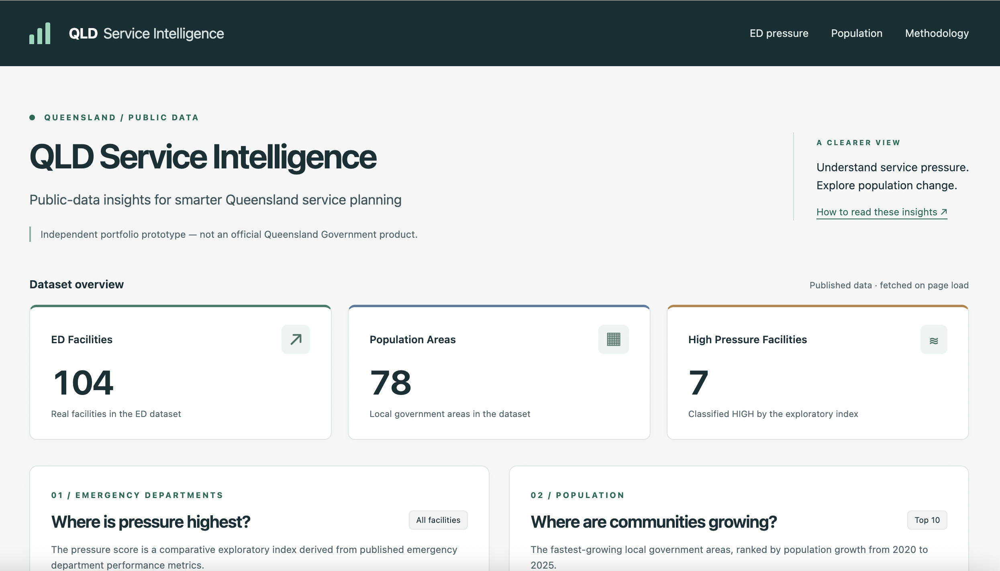
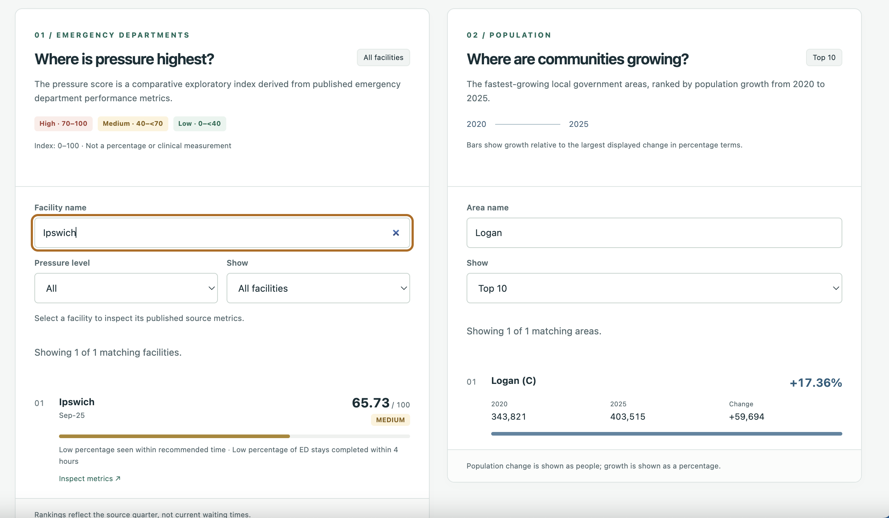
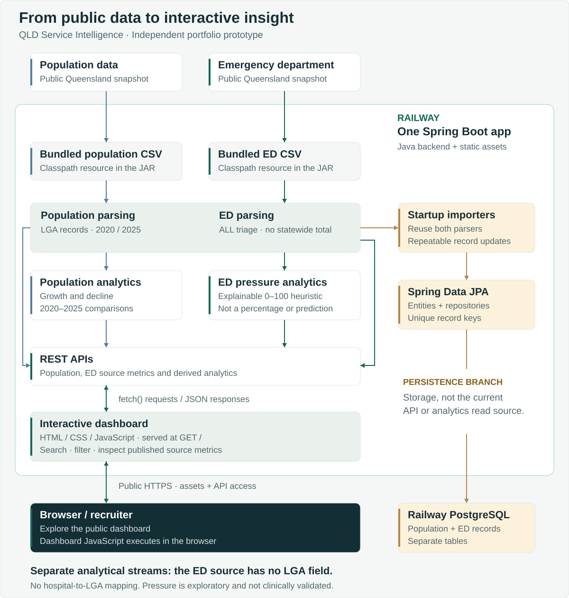
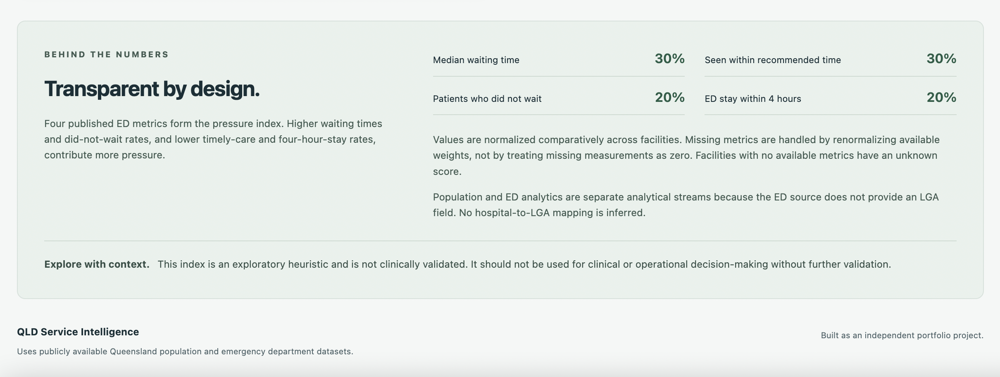

<!-- LIVE DASHBOARD: Single public-demo link location. -->
[**View Live Dashboard ↗**](https://qld-service-intelligence-production.up.railway.app)

Public Queensland datasets contain useful service-planning signals, but turning separate CSV files into explorable insights takes parsing, data-quality checks and clear explanations. This project makes population change and emergency department performance accessible through a Java/Spring Boot API and an interactive dashboard.

**An independent portfolio prototype using publicly available Queensland data.** It demonstrates an exploration tool for analysts and service-planning teams, alongside the engineering behind ingestion, persistence and explainable analytics. It is not an official Queensland Government product.

[Dashboard](#dashboard) · [Architecture](#architecture) · [Run locally](#run-locally) · [API](#api-endpoints) · [Testing](#testing)

| Source scope | Engineering highlights |
| --- | --- |
| **104 ED facility records** · Sep-25 · statewide aggregate excluded | Explainable pressure index with deterministic drivers |
| **78 population local-area records** · 2020–2025 comparison | Growth rankings and searchable area exploration |
| **Two separate analytical streams** | PostgreSQL persistence and repeatable startup imports |
| **59 passing automated tests** · verified 9 September 2026 | Parser, analytics, persistence, API and dashboard checks |

Counts describe the bundled source files, not an official count of all Queensland facilities or administrative areas. The test badge is a verified build snapshot, not a live CI badge.



*Public-data insights at a glance, with separate ED and population exploration.*

## Dashboard

The dashboard is served by Spring Boot at **`GET /`**, using plain HTML, CSS and JavaScript with no frontend framework or CDN dependencies.

- **Overview:** API-derived facility, population-area and high-pressure counts.
- **ED explorer:** case-insensitive facility search, combined pressure-level filtering, and Top 10 / All facilities views.
- **Facility inspector:** select a result to see its reporting quarter, index, drivers, unavailable metrics and four published source measurements. Records match by facility code and quarter.
- **Population explorer:** search areas and switch between Top 10 / All areas, with population totals, absolute change and growth percentages.
- **Interaction:** keyboard-accessible controls, responsive layouts, loading indicators, empty states and independent error/retry handling.

Top 10 limits the matching results. Unknown scores appear last in All views or matching searches/filters; the default unfiltered Top 10 excludes null scores. Filters operate on API responses without recalculating backend scores.



*Search facilities and areas, filter by pressure level, and select a facility to inspect its published ED source metrics.*

## Problem and approach

Public datasets often arrive separately, with metadata rows, inconsistent numeric formatting and unavailable measurements. Before meaningful exploration is possible, those details need to be handled consistently.

The prototype covers ingestion, persistence, analytics, API delivery and an interactive dashboard. It keeps the original files intact, makes analytical rules explicit and exposes source measurements beside derived scores. Its scope is comparative exploration, not a claim to solve healthcare planning.

## Architecture



One Railway-hosted Spring Boot application bundles the runtime CSVs, exposes the REST APIs and serves the dashboard assets; dashboard JavaScript runs in the browser and fetches API data over HTTPS. Population and ED remain separate analytical streams because the ED source has no LGA field, so no hospital-to-LGA mapping is inferred. Startup importers reuse the parsers to persist records through Spring Data JPA to Railway PostgreSQL, while API reads and analytics remain CSV-backed. The ED pressure index is an explainable exploratory heuristic, not a percentage or clinically validated prediction.

## Key features

| Area | Implementation |
| --- | --- |
| Data ingestion | Apache Commons CSV parsing; population metadata/header handling; ED `ALL` triage selection and statewide aggregate exclusion. |
| Persistence | JPA entities and repositories; transactional startup imports update existing rows. Unique keys are trimmed LGA name for population, and facility code + quarter for ED. |
| Population analytics | 2020 and 2025 totals, absolute change, percentage growth, fastest-growing and declining areas. A zero baseline produces an undefined growth percentage. |
| ED pressure analytics | Weighted comparative normalization, missing-metric handling, pressure levels, top-ranked facilities and up to two deterministic drivers. |
| Dashboard | Search, filters, ranked bars, expandable source-metric inspectors and separate population exploration. |
| Testing / reliability | Automated parser, analytics, database and HTTP checks; H2 isolation; graceful frontend request failures and retries. |

Repeat imports preserve record identity and update values rather than accumulating duplicates. Database uniqueness constraints also reject duplicate keys.

## Pressure methodology

The pressure score is a **0–100 comparative index, not a percentage**. It is an exploratory heuristic, not a clinically validated measure or predictive model, and must not be treated as an operational recommendation.

| Metric | Direction associated with higher pressure | Weight |
| --- | --- | --- |
| Median waiting time | Higher | 30% |
| Patients seen within recommended time | Lower | 30% |
| Patients who did not wait | Higher | 20% |
| ED stay within 4 hours | Lower | 20% |

For each metric, minima and maxima come from non-null observations across the full facility cohort:

```text
Higher-is-worse component = 100 × (value − min) / (max − min)
Lower-is-worse component = 100 × (max − value) / (max − min)
Pressure score = Σ(available component × weight) / Σ(available weight)
```

Missing observations are omitted and available weights are renormalized. A constant metric contributes zero comparative pressure while retaining its available weight. With no available metrics, the score is null and its level is UNKNOWN.

Scores are rounded HALF_UP to two decimals; the rounded score determines the level:

| LOW | MEDIUM | HIGH | UNKNOWN |
| --- | --- | --- | --- |
| 0 to below 40 | 40 to below 70 | 70 through 100 | Null score |

Drivers describe the strongest positive weighted contributions, with fixed metric-order tie-breaking. Cohort extremes and missingness affect comparability. See the [full pressure methodology](docs/emergency-department-pressure.md) for details.



*Transparent metric weights, missing-value handling and clear limits on responsible use.*

## Responsible data use and design decisions

- **No fabricated geography:** the ED source has no LGA field, so hospitals are not mapped to population areas and the streams are not joined.
- **Missing is not zero:** unavailable measurements remain distinguishable from measured zero values.
- **Facilities, not statewide totals:** ED facility code `99999` identifies the Queensland aggregate and is excluded; only `ALL` triage records enter facility analytics.
- **Traceable explanations:** drivers are deterministic labels based on contributions, not LLM-generated text.
- **Clear boundaries:** this independent project implies no government endorsement. The index requires further validation before any clinical or operational decision-making use.

## Data sources

| Bundled dataset | Source information and scope |
| --- | --- |
| [Queensland LGA population, 2001–2025p](data/raw/qld_lga_population_2001_2025.csv) | CSV title: “Estimated resident population by local government area (LGA), Queensland, 2001 to 2025p”. The file credits **ABS Regional Population Growth, Australia, 2024-25 (various editions)**. Its notes identify ASGS Edition 3, 2021 geographies and `p` as preliminary / `r` as revised. The application compares 2020 with 2025p across 78 source local-area records. |
| [Queensland emergency department data, Sep-25](data/raw/qld_emergency_department_sep2025.csv) | Quarterly facility/HHS and triage-category performance records, including attendance, waiting-time and treatment metrics. The application selects 104 real facility records for `ALL`, excluding the statewide Queensland aggregate. |

Exact official download URLs are not documented in the repository, so none are invented here. Links above point to the actual bundled source files. Results reflect these snapshots, not live hospital conditions.

## API endpoints

| Method | Path | Response |
| --- | --- | --- |
| GET | `/` | Interactive dashboard |
| GET | `/api/v1/status` | Service name and status; not a database health probe |
| GET | `/api/v1/population` | Source areas and 2025 population |
| GET | `/api/v1/population/growth` | 2020–2025 totals, change and growth |
| GET | `/api/v1/population/growth/fastest` | Up to 10 highest non-null growth percentages |
| GET | `/api/v1/population/growth/declining` | Negative growth, ordered from most negative |
| GET | `/api/v1/emergency-departments` | Real facility records and published ED metrics |
| GET | `/api/v1/emergency-departments/pressure` | Facility indices, levels, drivers and unavailable metrics |
| GET | `/api/v1/emergency-departments/pressure/highest` | Up to 10 highest non-null pressure scores |

## Technology stack

**Backend:** Java 21 target, Spring Boot 4.1.1, Spring Web MVC, Spring Data JPA, PostgreSQL and Apache Commons CSV.

**Frontend:** semantic HTML, responsive CSS and vanilla JavaScript with `fetch()`.

**Build and tests:** Maven Wrapper, JUnit Jupiter, Spring Boot testing, MockMvc, AssertJ and H2. HTTP dashboard tests use Java's HTTP client against an embedded server.

## Run locally

### 1. Prerequisites and clone

Install a JDK supporting Java 21, Git, and PostgreSQL with its `createdb` command-line utility. PostgreSQL is required to run the application, but **not to run tests**. Maven is supplied through the wrapper; its first run needs network access to download dependencies.

```bash
git clone https://github.com/antraagrawal2503/qld-service-intelligence.git
cd qld-service-intelligence
java -version
```

Run Maven commands from the repository root. Runtime CSVs are bundled under `src/main/resources/data/` and read as classpath streams, including from the packaged Spring Boot JAR. The original `data/raw/` files are retained for provenance; keep the bundled copies in sync when updating datasets. The examples below use Bash or Zsh on macOS/Linux; Windows users can use `mvnw.cmd` and set equivalent environment variables in their shell.

### 2. Run the tests

```bash
./mvnw test
```

Database tests activate the test profile and use in-memory H2. No local PostgreSQL server, username or password is needed. Dashboard HTTP tests bind a temporary local port.

### 3. Prepare PostgreSQL

Start PostgreSQL on `localhost:5432`. Use an existing local PostgreSQL role with permission to create and own the database. Replace the username placeholder below with that role:

```bash
export DB_USERNAME='your_postgres_role'
createdb -h localhost -p 5432 -U "$DB_USERNAME" -W qld_service_intelligence
```

Enter that role's password when prompted. If `qld_service_intelligence` already exists, skip creation and ensure the role has permission to create/update tables in it. If your role cannot create databases, have a local database administrator create it with your role as owner.

Set the application's password in the same terminal without writing it into a file or command history:

```bash
printf 'PostgreSQL password: '
read -r -s DB_PASSWORD
printf '\n'
export DB_PASSWORD
```

The application reads `DB_USERNAME` and `DB_PASSWORD` from the environment. Do not commit credentials. Its development configuration uses Hibernate `ddl-auto=update` to create/update the JPA tables at startup; no manual schema import is required.

### 4. Start and explore

```bash
./mvnw spring-boot:run
```

Startup imports the bundled population and ED records into PostgreSQL. Repeated starts update existing records using their stable keys.

Open **[http://localhost:8080](http://localhost:8080)**. Try a facility search, change the pressure filter, and select a facility to compare its index with the published measurements. Explore population areas in the separate panel. Stop the application with `Ctrl+C`.

## Testing

Verified on **9 September 2026** with `./mvnw test`:

```text
Tests run: 59, Failures: 0, Errors: 0, Skipped: 0
BUILD SUCCESS
```

The suite checks CSV parsing and exclusions, population growth, both normalization directions, weighted scores and boundaries, missing-value handling, deterministic drivers, JPA persistence and repository lookup, import idempotency, API responses, and dashboard/static-resource availability.

The test count is a snapshot of the current suite. It is not a code-coverage percentage or an end-to-end browser-testing claim.

## Project structure

```text
qld-service-intelligence/
├── data/raw/                 # Bundled public CSV snapshots
├── docs/                     # Methodology and presentation assets
│   └── assets/               # SVG banner, badges and dashboard screenshots
├── src/main/java/com/antra/qldserviceintelligence/
│   ├── controller/           # REST endpoints
│   ├── model/                # DTOs and JPA entities
│   ├── repository/           # Spring Data JPA repositories
│   └── service/              # Parsers, importers and analytics
├── src/main/resources/
│   ├── data/                 # Runtime CSVs bundled in the application JAR
│   ├── static/               # Dashboard HTML, CSS and JavaScript
│   └── application.properties
├── src/test/                 # Automated tests, fixtures and H2 profile
├── pom.xml
└── mvnw                      # Maven Wrapper (mvnw.cmd on Windows)
```

## Current limitations

- A single ED quarter, Sep-25, is loaded; the dashboard does not show live wait times or longitudinal trends.
- The pressure index is heuristic and has no clinical or operational validation.
- Population and ED data are not geographically joined.
- APIs remain CSV-backed even though imports persist the records; database-backed reads are future work.
- The public dashboard is hosted on Railway; managed migrations and operational hardening remain outside the current prototype.

## Future improvements

- Ingest additional reporting quarters and add trend analytics with comparable cohorts.
- Introduce database-backed reads and managed schema migrations.
- Explore geographic enrichment only where official, defensible mappings exist.
- Extend deployment documentation and add automated delivery checks.
- Consider forecasting or ML only if sufficient longitudinal data and an appropriate validation strategy justify it.

---

Built as an independent portfolio project.
